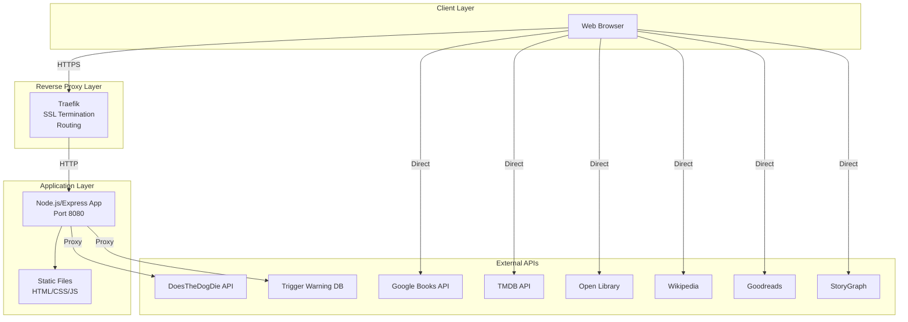
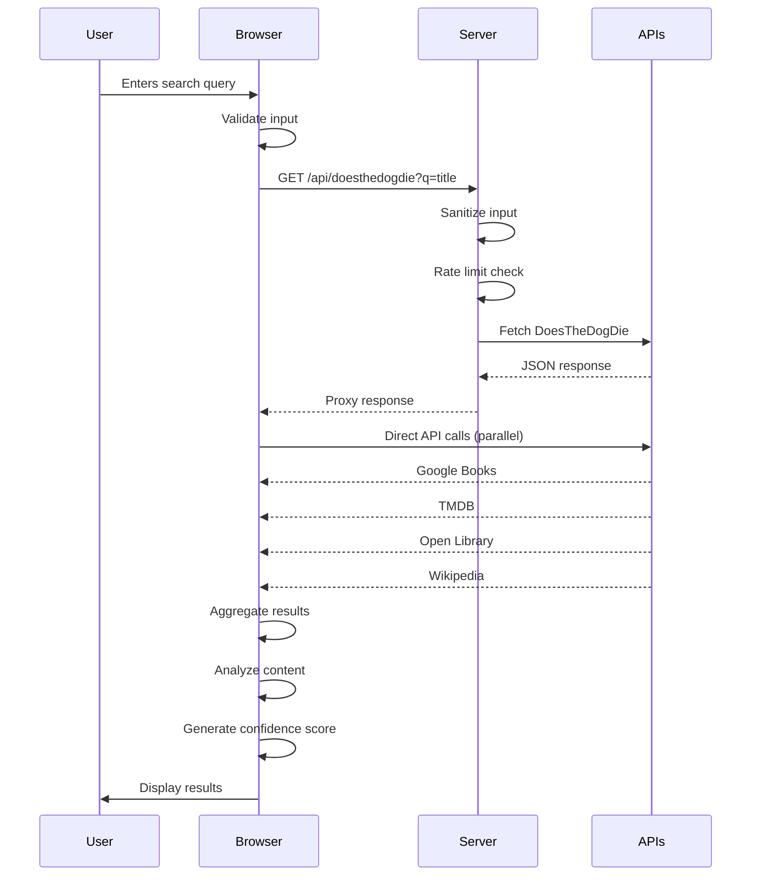
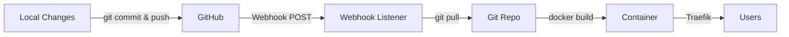
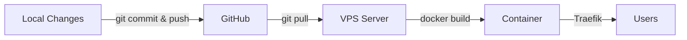

# Architecture Documentation

This document describes the architecture of Lauren's List - a reusable template for building content warning/trigger warning websites with multi-source data aggregation.

## Table of Contents

1. [System Overview](#system-overview)
2. [Architecture Diagrams](#architecture-diagrams)
3. [Component Architecture](#component-architecture)
4. [Deployment Architecture](#deployment-architecture)
5. [Data Flow](#data-flow)
6. [API Integration Patterns](#api-integration-patterns)
7. [Security Architecture](#security-architecture)
8. [Reusability Guide](#reusability-guide)

---

## System Overview

Lauren's List is a **Single Page Application (SPA)** with a **Node.js/Express backend** that aggregates data from multiple APIs to provide content warnings for books and movies.

### Key Characteristics

- **Frontend**: Vanilla JavaScript (no framework), HTML5, CSS3
- **Backend**: Node.js with Express.js
- **Containerization**: Docker
- **Reverse Proxy**: Traefik with automatic SSL
- **Deployment**: VPS with Docker Compose (supports dev/prod environments)
- **API Strategy**: Client-side direct calls + server-side proxy for CORS-sensitive APIs

---

## Architecture Diagrams

### System Architecture Overview



### Deployment Architecture

```mermaid
graph TB
    subgraph "VPS Server"
        subgraph "Docker Compose"
            Traefik[Traefik Container<br/>Port 80/443]
            Prod[Production Container<br/>laurenslist<br/>Port 8080]
            Dev[Dev Container<br/>laurenslist-dev<br/>Port 8080]
            Webhook[Webhook Listener<br/>Port 3000]
        end
        
        subgraph "Git Repository"
            Code[/root/laurens-list<br/>Git Repo]
        end
    end
    
    subgraph "External"
        GitHub[GitHub Repository]
        Users[Users]
    end
    
    GitHub -->|git push| GitHub
    GitHub -->|Webhook POST| Webhook
    Webhook -->|git pull| Code
    Code -->|Build Context| Prod
    Code -->|Build Context| Dev
    Users -->|https://laurenslist.org| Traefik
    Users -->|https://dev.laurenslist.org| Traefik
    Users -->|https://webhook.laurenslist.org| Traefik
    Traefik -->|Route| Prod
    Traefik -->|Route| Dev
    Traefik -->|Route| Webhook
```

### Data Flow Diagram



---

## Component Architecture

### Frontend Components

#### File Structure
```
frontend/
├── index.html          # Main HTML structure
├── styles.css          # All styling (CSS3)
└── script.js           # Application logic (vanilla JS)
```

#### Key Frontend Classes

**LaurensList Class** (`script.js`)
- **Purpose**: Main application controller
- **Responsibilities**:
  - Event handling (search, UI toggles)
  - API orchestration (parallel searches)
  - Data aggregation from multiple sources
  - Content analysis (term detection, semantic analysis)
  - UI rendering (results, analysis, errors)

**Key Methods**:
- `searchBook(query, exactMatch)` - Orchestrates book search across 8 sources
- `searchMovie(query, exactMatch)` - Orchestrates movie search across 5 sources
- `analyzeContent(data)` - Analyzes aggregated data for sensitive content
- `displayResults(data)` - Renders results to DOM

#### Frontend API Integration Pattern

```javascript
// Parallel API calls with timeout
const searchPromises = [
    this.withTimeout(this.searchGoogleBooks(query), 15000),
    this.withTimeout(this.searchOpenLibrary(query), 15000),
    this.withTimeout(this.searchWikipedia(query), 15000),
    // ... more sources
];

// Wait for all (success or failure)
const results = await Promise.allSettled(searchPromises);
```

### Backend Components

#### File Structure
```
backend/
├── server.js           # Express server
├── package.json        # Dependencies
└── Dockerfile          # Container definition
```

#### Server Architecture

**Express Server** (`server.js`)
- **Port**: 8080
- **Responsibilities**:
  - Static file serving (HTML, CSS, JS, images)
  - API proxy endpoints (CORS bypass)
  - Rate limiting (security)
  - Input sanitization (security)
  - SPA routing (catch-all to index.html)

**Key Endpoints**:
- `GET /` - Serves index.html
- `GET /api/doesthedogdie?q=query` - Proxies DoesTheDogDie API
- `GET /api/triggerwarning` - Proxies Trigger Warning Database
- `GET /*` - SPA routing (serves index.html for non-API routes)

**Security Features**:
- Rate limiting: 20 requests per 15 minutes per IP
- Input sanitization: Removes HTML, scripts, limits length
- CORS enabled for API endpoints
- No-cache headers for script.js (security)

---

## Deployment Architecture

### Automated Deployment System

The system includes automated deployment for both **dev** and **production** environments via GitHub webhooks. Separate webhook listeners handle each environment for security and isolation.

#### Dev Webhook Listener Service

**Purpose**: Receives GitHub webhooks and automatically deploys `dev` branch changes.

**Components**:
- **`webhook-listener.js`**: Express.js server that:
  - Listens on port 3000
  - Receives POST requests from GitHub
  - Validates GitHub webhook signatures using `WEBHOOK_SECRET`
  - Only processes `push` events to `dev` branch (rejects `main` and others)
  - Executes `deploy-dev-webhook.sh` on valid webhooks

- **`deploy-dev-webhook.sh`**: Bash script that:
  - Pulls latest code from GitHub (`dev` branch)
  - Stashes local changes (prevents merge conflicts)
  - Rebuilds Docker image using `docker build`
  - Restarts `laurenslist-dev` container

- **`Dockerfile.webhook`**: Container image that:
  - Includes Node.js 18
  - Installs git, bash, and Docker CLI tools
  - Mounts Docker socket for container control
  - Mounts git repository for code access

**Network Configuration**:
- All services must be on the same Docker network (`root_default`)
- Traefik routes `https://webhook.laurenslist.org` to dev webhook listener
- DNS A record: `webhook.laurenslist.org` → server IP

**Security Features**:
- GitHub webhook signature verification (HMAC-SHA256)
- Branch filtering (only `dev` branch deploys automatically)
- HTTPS enforced via Traefik
- Production branch (`main`) explicitly rejected

**Deployment Flow**:
1. Developer pushes to `dev` branch on GitHub
2. GitHub sends webhook POST to `https://webhook.laurenslist.org`
3. Traefik routes request to `webhook-listener` container
4. Webhook listener validates signature and branch
5. **Immediate Response**: Listener responds with `202 Accepted` immediately (prevents GitHub timeout)
6. **Async Deployment**: If valid, executes `deploy-dev-webhook.sh` asynchronously in background
7. Deployment script pulls code, rebuilds, and restarts dev container (takes 16-36 seconds)
8. Changes are live on `dev.laurenslist.org`

#### Production Webhook Listener Service

**Purpose**: Receives GitHub webhooks and automatically deploys `main` branch changes to production.

**Components**:
- **`webhook-listener-prod.js`**: Express.js server that:
  - Listens on port 3000 (separate container)
  - Receives POST requests from GitHub
  - Validates GitHub webhook signatures using `WEBHOOK_SECRET_PROD` (separate secret)
  - Only processes `push` events to `main` branch (rejects `dev` and others)
  - Executes `deploy-prod-webhook.sh` on valid webhooks

- **`deploy-prod-webhook.sh`**: Bash script that:
  - Pulls latest code from GitHub (`main` branch)
  - Stashes local changes (prevents merge conflicts)
  - Rebuilds Docker image using `docker build`
  - Restarts `laurenslist` container (production)

- **`Dockerfile.webhook.prod`**: Container image that:
  - Includes Node.js 18
  - Installs git, bash, and Docker CLI tools
  - Mounts Docker socket for container control
  - Mounts git repository for code access

**Network Configuration**:
- All services must be on the same Docker network (`root_default`)
- Traefik routes `https://webhook-prod.laurenslist.org` to production webhook listener
- DNS A record: `webhook-prod.laurenslist.org` → server IP

**Security Features**:
- GitHub webhook signature verification (HMAC-SHA256)
- **Separate webhook secret** (`WEBHOOK_SECRET_PROD`) for extra security
- Branch filtering (only `main` branch deploys automatically)
- HTTPS enforced via Traefik
- Dev branch explicitly rejected

**Deployment Flow**:
1. Developer pushes to `main` branch on GitHub
2. GitHub sends webhook POST to `https://webhook-prod.laurenslist.org`
3. Traefik routes request to `webhook-listener-prod` container
4. Webhook listener validates signature and branch
5. **Immediate Response**: Listener responds with `202 Accepted` immediately (prevents GitHub timeout)
6. **Async Deployment**: If valid, executes `deploy-prod-webhook.sh` asynchronously in background
7. Deployment script pulls code, rebuilds, and restarts production container (takes ~6-10 seconds)
8. Changes are live on `laurenslist.org`

**Timeout Prevention**: GitHub times out after ~10 seconds, but deployment takes 6-10 seconds. The webhook responds immediately with `202 Accepted` and runs deployment asynchronously to prevent timeouts while ensuring deployments complete successfully.

**Rollback Prevention**: The deployment system uses **unique image tags** (commit hash-based) instead of `latest` to prevent rollbacks:
- Each deployment gets a unique tag (e.g., `dev-c006ce1`, `prod-c006ce1`)
- **CRITICAL**: `docker-compose.yml` is updated IMMEDIATELY after `git pull` (before build) - this prevents git from reverting the unique tag changes since `docker-compose.yml` is tracked by git
- If `git reset --hard` happens during build context verification, the unique tag is re-applied to `docker-compose.yml`
- Always uses `/app/docker-compose.yml` (mounted volume) consistently throughout - this is what Docker Compose reads
- When containers restart, Docker Compose uses the pinned unique tag, not a mutable `latest` tag
- Build context verification ensures latest code is used before building
- `SCRIPT_VERSION` is automatically updated during Docker build using `GIT_COMMIT` build arg

**Verified Working**: Production webhook successfully deployed and tested on November 5, 2025. Deployment completes in ~6 seconds with zero downtime. Rollback prevention verified and working.

**Production Setup Issues Resolved** (November 7, 2025):
- Fixed deployment script path handling (works both in container and on host using `PROJECT_DIR` variable)
- Fixed environment variable passing from webhook listener to deployment script (now passes all `process.env` variables correctly)
- Added environment variable loading for manual host execution (loads from `/root/.env`)
- Added `ENV_SUFFIX` build arg to Dockerfile for dev/prod distinction in `SCRIPT_VERSION`
- Implemented rollback prevention with unique image tags and pinned `docker-compose.yml`
- Added build context verification to ensure latest code is used
- Added `SCRIPT_VERSION` auto-update during Docker build using `GIT_COMMIT` and `ENV_SUFFIX` build args
- **Simplified to match dev's proven working approach** (removed complex git protection logic)
- Uses simple `sed` update of `docker-compose.yml` like dev (proven to work reliably)
- **Fixed critical rollback issue (Commit 611f71d)**: Update `docker-compose.yml` immediately after `git pull` to prevent git from reverting unique tag changes. Re-apply unique tag after `git reset --hard` if it happens. Always use `/app/docker-compose.yml` consistently throughout.

**Rollback Prevention Verified**: 
- November 7, 2025 - Production deployment verified working with unique tags (`prod-b62c36d`). Script simplified to match dev's proven working approach. Container restarts confirmed to use pinned unique tag, not `latest`.
- **Latest Fix (Commit 611f71d)**: Fixed critical issue where `git pull` was reverting the unique tag changes. Solution: Update `docker-compose.yml` IMMEDIATELY after `git pull` (before build) and re-apply unique tag after `git reset --hard` if it happens. Always use `/app/docker-compose.yml` consistently throughout. **Verified working** - production container confirmed using latest version (`611f71d-prod`).

**Key Lesson Learned**: Dev works reliably with simple `sed` update of `docker-compose.yml` without complex git protection logic. Production now uses the same simple, proven approach. **Critical addition**: Must update `docker-compose.yml` immediately after `git pull` to prevent git from reverting the unique tag changes.

See `PRODUCTION_WEBHOOK_SETUP.md` for detailed troubleshooting of these issues.

**Setup Time**:
- Initial setup: ~1-2 hours (includes troubleshooting)
- Subsequent setups: ~30-45 minutes (can copy configuration)

**Reference**: See `WEBHOOK_SETUP_INSTRUCTIONS.md` for complete setup guide.

### Docker Architecture

**Container Structure**:
```yaml
services:
  traefik:          # Reverse proxy, SSL termination
  laurenslist:      # Production app container
  laurenslist-dev:  # Development/staging container
  webhook-listener: # Automated deployment webhook receiver (dev branch)
  webhook-listener-prod: # Automated deployment webhook receiver (main branch)
```

**Build Process**:
1. Git checkout (branch determines environment)
2. Docker build with API keys injected via build args
3. Container runs `node server.js` on port 8080
4. Traefik routes traffic based on hostname

### Environment Separation

**Production**:
- Branch: `main`
- Domain: `laurenslist.org`, `www.laurenslist.org`
- Container: `laurenslist`
- Environment: `NODE_ENV=production` (implicit)

**Development**:
- Branch: `dev` (or any feature branch)
- Domain: `dev.laurenslist.org`
- Container: `laurenslist-dev`
- Environment: `NODE_ENV=development`

### Deployment Workflow

#### Automated Deployment (Dev)



**Dev Deployment (Automated)**:
- Push to `dev` branch triggers GitHub webhook
- Webhook listener receives POST request
- Validates GitHub signature
- Executes `deploy-dev-webhook.sh`:
  - Pulls latest code from GitHub
  - Rebuilds Docker image
  - Restarts `laurenslist-dev` container
- Deployment completes automatically

**Components**:
- `webhook-listener.js` - Express.js server that receives GitHub webhooks
- `deploy-dev-webhook.sh` - Bash script that performs deployment
- `Dockerfile.webhook` - Container image with Node.js, git, and Docker CLI
- GitHub webhook configured to send POST to `https://webhook.laurenslist.org`

#### Manual Deployment (Production)



**Production Deployment (Manual - SSH)**:
```bash
cd /root/laurens-list
git checkout main
git pull origin main
cd /root
docker compose stop laurenslist
docker compose build laurenslist --no-cache
docker compose up -d laurenslist
```

**Why Production is Manual**:
- Safety: Production deployments require explicit approval
- Stability: Prevents accidental deployments
- Control: Manual process allows for verification before deployment

---

## Data Flow

### Search Request Flow

1. **User Input** → Browser validates and sanitizes
2. **Parallel API Calls** → Multiple sources queried simultaneously
3. **Server Proxy** → CORS-protected APIs routed through backend
4. **Data Aggregation** → Results collected from all sources
5. **Content Analysis** → Term detection, semantic analysis, confidence scoring
6. **Result Rendering** → UI updates with safety status and analysis

### API Integration Strategy

**Client-Side Direct Calls** (No CORS issues):
- Google Books API
- TMDB API
- Open Library API
- Wikipedia API
- Goodreads (scraping)
- StoryGraph (scraping)

**Server-Side Proxy** (CORS protection):
- DoesTheDogDie API (requires API key)
- Trigger Warning Database (scraping)

**Why Proxy?**
- Some APIs require API keys (security - don't expose in client)
- CORS restrictions for certain domains
- Rate limiting enforcement
- Input sanitization before external calls

---

## API Integration Patterns

### Pattern 1: Direct Client-Side API Call

```javascript
async searchGoogleBooks(query) {
    const url = `https://www.googleapis.com/books/v1/volumes?q=${encodeURIComponent(query)}&key=${GOOGLE_BOOKS_API_KEY}`;
    const response = await fetch(url);
    return await response.json();
}
```

**Use When**:
- API allows CORS
- No sensitive API keys (or public keys are acceptable)
- Rate limiting handled by API provider

### Pattern 2: Server-Side Proxy

**Client Side**:
```javascript
async searchDoesTheDogDie(query) {
    const response = await fetch(`/api/doesthedogdie?q=${encodeURIComponent(query)}`);
    return await response.json();
}
```

**Server Side**:
```javascript
app.get('/api/doesthedogdie', apiLimiter, async (req, res) => {
    const query = sanitizeServerInput(req.query.q);
    const response = await fetch(`https://api.example.com?q=${query}`, {
        headers: { 'X-API-KEY': DOESTHEDOGDIE_API_KEY }
    });
    res.json(await response.json());
});
```

**Use When**:
- API requires authentication (don't expose keys)
- CORS restrictions
- Need server-side rate limiting
- Need input sanitization

### Pattern 3: Web Scraping

```javascript
async searchGoodreads(query) {
    const url = `https://www.goodreads.com/search?q=${encodeURIComponent(query)}`;
    const response = await fetch(url);
    const html = await response.text();
    // Parse HTML with regex/DOM parsing
    return parseGoodreadsData(html);
}
```

**Use When**:
- No official API available
- Public data that's acceptable to scrape
- Parsing is straightforward

---

## Security Architecture

### Security Layers

1. **Input Sanitization**
   - Client-side: Basic validation
   - Server-side: HTML/script removal, length limits, character filtering

2. **Rate Limiting**
   - Server-side: 20 requests per 15 minutes per IP
   - Prevents abuse and DoS attacks

3. **API Key Management**
   - Build-time injection via Docker build args
   - Environment variables (not in Git)
   - No exposure in client-side code for sensitive keys

4. **HTTPS/TLS**
   - Traefik handles SSL certificates (Let's Encrypt)
   - Automatic HTTP → HTTPS redirect

5. **CORS Configuration**
   - Server-side proxy for sensitive APIs
   - CORS enabled for API endpoints

### Security Best Practices

- ✅ API keys never committed to Git
- ✅ Server-side input sanitization
- ✅ Rate limiting on API endpoints
- ✅ No-cache headers for script.js (prevents stale cached keys)
- ✅ Environment variable injection
- ✅ HTTPS enforced

---

## Reusability Guide

This architecture can be adapted for other content warning websites or similar multi-source aggregation applications.

### Template Adaptation Steps

#### 1. Define Your Domain

**Replace**:
- Content analysis logic (currently cancer-specific)
- Term lists (currently cancer-related terms)
- Known content database (currently cancer-themed works)

**Example**: For mental health triggers:
```javascript
const MENTAL_HEALTH_TERMS = [
    'suicide', 'self-harm', 'depression', 'anxiety',
    'eating disorder', 'PTSD', 'trauma'
];
```

#### 2. Update API Sources

**Replace**:
- Book search APIs (if needed)
- Movie search APIs (if needed)
- Content warning databases

**Example**: Add new API source:
```javascript
async searchNewSource(query) {
    const url = `https://api.newsource.com/search?q=${query}`;
    const response = await fetch(url);
    return await response.json();
}
```

#### 3. Customize Content Analysis

**Replace**:
- Detection logic in `analyzeContent()` method
- Confidence scoring algorithm
- Term matching patterns

**Example**: Custom analysis:
```javascript
analyzeContent(data) {
    const triggers = this.detectTriggers(data);
    const confidence = this.calculateConfidence(triggers);
    return {
        status: confidence > 80 ? 'not-recommended' : 'safe',
        confidence,
        triggers
    };
}
```

#### 4. Update UI/Theming

**Replace**:
- `styles.css` - Color scheme, branding
- `index.html` - Site name, description, branding
- Favicon and manifest files

#### 5. Configure Deployment

**Update**:
- `docker-compose.yml` - Domain names, service names
- Environment variables
- Traefik labels

**Example**:
```yaml
laurenslist:
  labels:
    - "traefik.http.routers.mysite.rule=Host(`mysite.org`)"
```

### Architecture Decisions

**Why Vanilla JavaScript?**
- No build step required
- Simple deployment
- Easy to understand and modify
- Fast page loads

**Why Express Backend?**
- Minimal overhead
- Simple API proxy pattern
- Easy to extend with more endpoints
- Good for static file serving

**Why Docker?**
- Consistent environments (dev/prod)
- Easy deployment
- Isolated containers
- Easy rollback

**Why Traefik?**
- Automatic SSL certificates
- Easy reverse proxy configuration
- Docker integration
- Multiple domain support

### Key Reusable Patterns

1. **Multi-Source Aggregation**: Parallel API calls with timeout
2. **Server-Side Proxy**: CORS bypass pattern
3. **Dual Environment**: Dev/prod separation
4. **Build-Time Config**: API key injection
5. **SPA Routing**: Catch-all to index.html
6. **Rate Limiting**: Security pattern
7. **Input Sanitization**: Security pattern
8. **Automated Deployment**: GitHub webhook integration for both dev and production environments with separate secrets and endpoints

---

## Technology Stack Summary

### Frontend
- **HTML5**: Semantic markup
- **CSS3**: Modern styling (gradients, flexbox, animations)
- **Vanilla JavaScript (ES6+)**: No frameworks
- **Fetch API**: HTTP requests
- **Promise.allSettled()**: Parallel async operations

### Backend
- **Node.js 18**: Runtime
- **Express.js 5**: Web framework
- **CORS**: Cross-origin support
- **express-rate-limit**: Rate limiting
- **node-fetch**: HTTP client

### Infrastructure
- **Docker**: Containerization
- **Docker Compose**: Multi-container orchestration
- **Traefik**: Reverse proxy, SSL termination
- **Let's Encrypt**: SSL certificates

### APIs Used
- **Google Books API**: Book search
- **TMDB API**: Movie search
- **DoesTheDogDie API**: Trigger warnings
- **Open Library API**: Book metadata
- **Wikipedia API**: Content summaries
- **Goodreads**: Book reviews (scraping)
- **StoryGraph**: Content warnings (scraping)
- **Trigger Warning Database**: Curated warnings (scraping)

---

## File Structure

```
laurens-list/
├── index.html              # Frontend HTML
├── styles.css              # Frontend CSS
├── script.js               # Frontend JavaScript
├── server.js               # Backend Express server
├── package.json            # Node.js dependencies
├── Dockerfile              # Container definition
├── Dockerfile.webhook      # Webhook listener container
├── docker-compose.yml      # Multi-container config
├── webhook-listener.js     # Webhook receiver service
├── deploy-dev-webhook.sh   # Automated deployment script
├── build.js                # Build script (API key injection)
├── .gitignore             # Git ignore rules
├── .cursorrules            # Cursor IDE rules
├── README.md              # User documentation
├── ARCHITECTURE.md        # This file
├── ARCHITECTURE_QUICK_REFERENCE.md  # Quick reference
├── TEMPLATE_REUSE_GUIDE.md  # Template reuse guide
├── WEBHOOK_SETUP_INSTRUCTIONS.md  # Webhook setup guide
├── DEV_TO_PROD_DEPLOYMENT.md  # Deployment guide
└── config.example.js       # Config template (not in Git)
```

---

## Performance Considerations

### Optimization Strategies

1. **Parallel API Calls**: All sources queried simultaneously
2. **Timeout Handling**: 15-second timeout per source (prevents hanging)
3. **Promise.allSettled()**: Continues even if some sources fail
4. **Client-Side Caching**: Results cached in memory (not persistent)
5. **Static File Serving**: Express serves static files efficiently
6. **No Build Step**: Direct file serving (fast)

### Scalability

**Current Architecture**:
- Single container per environment
- Suitable for: Low to medium traffic (< 1000 req/min)

**Scaling Options**:
- **Horizontal Scaling**: Multiple containers behind Traefik load balancer
- **Caching Layer**: Redis for API response caching
- **CDN**: CloudFront/Cloudflare for static assets
- **Database**: Store results for faster repeated queries

---

## Monitoring & Logging

### Current Logging

**Server Logs**:
- Request logging (method, path)
- API proxy activity
- Error logging

**Client Logs**:
- Console logging for debugging
- API call tracking
- Error reporting

### Monitoring Recommendations

1. **Health Check Endpoint**: `/health` endpoint
2. **Metrics**: Request count, response times
3. **Error Tracking**: Sentry or similar
4. **Uptime Monitoring**: UptimeRobot or similar

---

## Future Enhancements

### Potential Improvements

1. **Database Integration**: Cache results, user preferences
2. **User Accounts**: Save search history, preferences
3. **API Response Caching**: Reduce external API calls
4. **Advanced Analytics**: Track search patterns
5. **Mobile App**: React Native wrapper
6. **Browser Extension**: Quick search from any page

---

*Last Updated: January 2025*

